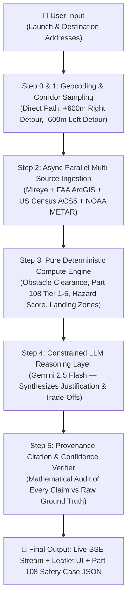

# 🛫 Airlane — Backend & Data Architecture Pitch Guide
> **High-Level Overview & Spoken Pitch Scripts (< 2 Minutes)**  
> *Designed for Hackathon Demos, Investor Pitches, and Technical Judge Walkthroughs.*

---

## ⏱️ Section 1: The 90-Second Spoken Pitch Script
*(Read at a natural, confident pace: ~130 words per minute. Total time: ~90 seconds)*

> **[0:00 – 0:20] The Problem:**  
> "Commercial drone delivery is undergoing a massive shift with the FAA’s upcoming **Part 108 BVLOS** (Beyond Visual Line of Sight) rule. But today, planning a compliant, safe BVLOS flight corridor takes **days of manual GIS analysis** across disconnected federal databases and satellite maps before a single drone can take off."

> **[0:20 – 0:50] The Solution & Real-World Data Feeds:**  
> "We built **Airlane** — an autonomous route risk screening and safety case engine. You enter any launch and destination address, and within seconds, our backend concurrently queries **4 real-world authoritative data sources** across every segment of the flight:
> 1. **Mireye Physical World AI**: Locates high-voltage transmission lines, electrical substations, terrain slope, and building footprints.
> 2. **FAA UAS Facility Maps (ArcGIS REST)**: Identifies controlled airspace classes (B, C, D, E) and exact maximum AGL ceiling limits.
> 3. **US Census Bureau (ACS5 API)**: Calculates exact population density per square mile down to the census tract.
> 4. **NOAA Aviation Weather (METAR)**: Ingests live wind velocity, gusts, and crosswind vectors."

> **[0:50 – 1:20] The Deterministic Compute Engine (Zero-LLM Math):**  
> "Instead of letting an AI guess safety numbers, Airlane uses a **100% deterministic mathematical compute engine**. It generates 3 distinct geometric flight corridors — direct, right detour, and left detour — and scores:
> - **Vertical obstacle clearance** against power infrastructure.
> - **Part 108 Ground Risk Tier** (Tiers 1 to 5 based on worst-case population exposure).
> - **Autonomous Emergency Forced Landing Zones** with maximum clearance and lowest structural density."

> **[1:20 – 1:45] Constrained Reasoning & Ground-Truth Provenance:**  
> "Only *after* the math is solved does our **Gemini reasoning layer** synthesize a human-readable, FAA-ready safety case explaining why the winning corridor was selected and why alternatives were rejected. Our **Provenance Verifier** mathematically audits every citation back to raw sensor data, guaranteeing **zero hallucinated risks** and generating a verifiable confidence score."

> **[1:45 – 2:00] The Value & Closing:**  
> "Airlane turns a 3-day manual GIS compliance nightmare into a **sub-second autonomous workflow**, unlocking safe, compliant autonomous flight at enterprise scale. Thank you!"

---

## ⚡ Section 2: 30-Second Elevator Pitch
*(Use for quick judge stops or rapid-fire introductions)*

> "Airlane is an autonomous safety engine for commercial drone flights under FAA Part 108. In under 5 seconds, our backend ingests **Mireye ground infrastructure**, **FAA airspace ceilings**, **Census population density**, and **NOAA weather** to mathematically evaluate multiple flight corridors. It classifies Part 108 ground risk tiers, identifies emergency landing zones, and outputs an audit-proof, source-cited safety case with zero AI hallucinations."

---

## 📊 Section 3: The 4 Authoritative Data Sources Ingested

Airlane fuses ground truth, regulatory constraints, human exposure, and atmospheric physics:

| # | Data Source | What We Pull | Why It Matters for Flight Safety |
|---|---|---|---|
| ⚡ | **Mireye Physical World AI** | High-voltage transmission lines (distance & kV), electrical substations, building footprints/heights, tree canopy, terrain slope | Detects physical collision hazards and electromagnetic interference zones along the flight path. |
| 🛩️ | **FAA UAS Facility Maps** *(ArcGIS REST API)* | UAS max flight ceiling (ft AGL), controlled airspace boundaries (Class B, C, D, E), airport proximity buffers | Prevents regulatory violations and conflicts with manned civil aviation. |
| 👥 | **US Census Bureau** *(Geocoder + ACS5 API)* | Census Tract FIPS, Land Area (`AREALAND`), Total Population estimate | Computes exact population density (people/sq mi) to classify **Part 108 Ground Risk Tiers (1–5)**. |
| 💨 | **NOAA Aviation Weather** *(METAR Stations)* | Surface wind speed (knots), wind direction, gusts, temperature | Calculates crosswind component against the drone's flight vector and small-UAV operating limits. |

---

## ⚙️ Section 4: The 5-Step Backend Pipeline Architecture

### 1. Multi-Corridor Geometric Sampling (`agent/corridor.py`)
- Geocodes origin and destination into high-precision coordinates.
- Generates **3 candidate trajectories**:
  - **Corridor A (Direct)**: Great-circle line sampled every 150–400m.
  - **Corridor B (Right Detour)**: +600m perpendicular Bezier curve detour.
  - **Corridor C (Left Detour)**: -600m perpendicular Bezier curve detour.

### 2. Async Parallel Ingestion & Spatial Grid Caching (`agent/fetcher.py`, `db.py`)
- Ingests data across all 3 corridors simultaneously using Python `asyncio.gather` and thread pools.
- Implements **~333m spatial grid memoization** in SQLite, reducing redundant network calls by over 80%.
- Strict graceful degradation: missing fields are flagged as `UNKNOWN` rather than assumed safe.

### 3. Pure Deterministic Compute Engine (`agent/compute.py`)
- **Zero-LLM scoring**: 100% pure, repeatable, unit-tested math functions.
- **Part 108 Tier Calculation**: Determines the *worst-case dominant tier* across the route:
  - *Tier 1*: Rural (<500 people/sq mi)
  - *Tier 2*: Low Density Suburban (500–2,000)
  - *Tier 3*: Medium Density Residential (2,000–5,000)
  - *Tier 4*: High Density Urban (5,000–12,000)
  - *Tier 5*: Dense Urban Core (>12,000)
- **Obstacle Vertical Clearance**: Flags any transmission line crossing within the drone's cruise altitude safety buffer.
- **Emergency Forced Landing Zones**: Ranks points with minimal building density and maximum obstacle clearance for emergency drop-ins.
- **Multi-Criteria Route Ranking**: Produces dimension winners (Tier Winner, Hazard Winner, Efficiency Winner) and itemized rejection reasons.

### 4. Constrained Reasoning Layer (`agent/reason.py`)
- Feeds pre-calculated mathematical facts into **Gemini 2.5 Flash** with strict JSON schema enforcement.
- Prompt constraints strictly forbid inventing numbers or overriding calculations.
- Generates executive summaries, route recommendations, and plain-English risk mitigations.

### 5. Provenance Citation & Confidence Verification (`agent/verify.py`)
- Audits every risk statement against raw ingested API responses.
- Generates a **0–100% Confidence Score** based on data completeness and sensor freshness.
- Attaches statutory FAA and Census legal disclaimers for compliance transparency.

---

## 🏆 Section 5: Key Talking Points & Pitch Buzzwords
*(Memorize these 5 punchlines for judge conversations)*

1. **"Zero-LLM Math"**: All risk scoring, obstacle clearance, and tier classification are pure deterministic Python functions — the AI never calculates safety numbers.
2. **"Worst-Case Safety Paradigm"**: We evaluate routes based on their highest-risk segment rather than masking hazards with route-wide averages.
3. **"Ground-Truth Provenance"**: Every claim in the safety report is linked with exact GPS coordinates and original source metadata (Mireye, FAA, Census).
4. **"Part 108 Ground Risk Classification"**: Built specifically around the FAA’s upcoming BVLOS regulatory framework using real Census ACS5 data.
5. **"Sub-Second Real-Time Streaming"**: FastAPI backend emits live execution steps over Server-Sent Events (SSE), visualizing the decision pipeline in real-time.

---

## 🎯 Section 6: Judge Q&A Defense Cheat Sheet

### Q1: "Is this output legally authoritative for actual flight authorization?"
> **Answer:**  
> *"No, and we state this prominently in the output. Airlane is a **pre-flight risk screening and safety case acceleration engine**. It collapses days of manual GIS and airspace feasibility work into seconds, producing the exact documentation an operator needs for their Part 108 safety filing."*

### Q2: "How do you prevent the LLM from hallucinating safety hazards or clearances?"
> **Answer:**  
> *"The LLM does **zero calculation**. All corridor generation, obstacle detection, tier lookups, and ranking occur in our deterministic compute engine. The LLM only receives pre-computed JSON facts to write the executive narrative. Furthermore, our `verify.py` layer runs a provenance audit on the output to guarantee no unverified facts appear."*

### Q3: "What happens if one of the external APIs is down or returns missing data?"
> **Answer:**  
> *"We follow aviation safety principles: missing data is never assumed to be clear airspace. The engine tags missing points as `UNKNOWN`, penalizes the route's overall confidence score, and explicitly warns the operator in the caveats section."*

### Q4: "Why evaluate 3 corridors instead of just a straight line?"
> **Answer:**  
> *"Direct paths frequently cross high-density census tracts or power transmission lines. By generating perpendicular detours (+600m and -600m), we give operators defensible trade-offs — showing that a 30-second longer detour can lower ground risk from Tier 4 down to Tier 2."*
